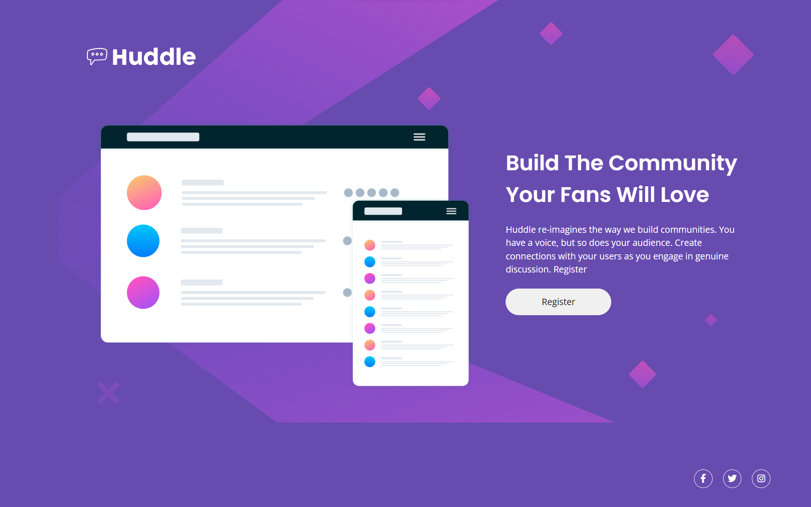

# Huddle Landing Page

This is the landing page for the Huddle website, which re-imagines the way communities are built and encourages genuine discussions among users.

You can view the live demo of this project [here](https://ahmedhanye.github.io/huddle-landing-page/).

## Table of Contents
- [Introduction](#introduction)
- [Features](#features)
- [Technologies Used](#technologies-used)
- [Installation](#installation)
- [Usage](#usage)
- [Contributing](#contributing)

## Introduction

The Huddle Landing Page is a project designed to showcase a modern and engaging website landing page. It features a clean and responsive design with a focus on user engagement and community building.

## Features

- Responsive design for various screen sizes.
- Eye-catching illustrations and graphics.
- Clear call-to-action (CTA) for user registration.
- Social media links in the footer for easy access.

## Technologies Used

- HTML5
- CSS3
- Font Awesome Icons
- Google Fonts
- Normalize.css

## Installation

To run this project locally, follow these steps:

1. Clone the repository to your local machine:

2. Navigate to the project directory:

3. Open the `index.html` file in your web browser.

## Usage

You can use this landing page as a template for your own projects or as an example of modern web design and user engagement.

Feel free to modify and customize it to suit your needs.

## Contributing

If you would like to contribute to this project, please open an issue or create a pull request. We welcome contributions and improvements!
